# Hi, I'm fooSynaptic 👋

  

> **ML Engineer** focused on LLM post training, and inference infrastructure.  

---

---

##  About Me

- **Machine Learning** & **Game AI**
- Building LLM-powered agents and multi-agent systems; researching frontier model mechanisms (MLA, MoE, DSA, DSpark)
- Languages: **C++ · Python · Java · JavaScript**

---

##  GitHub Stats

  

##  Motto

**fooSynaptic** — *foo* from the programmer's `foo` / `bar`: machine learning is, at heart, **learning to solve for the unknown**; *Synaptic* for intelligence wired like synapses.

## 📫 Contact

- Blog: [https://foosynaptic.github.io](https://foosynaptic.github.io)

---

  

