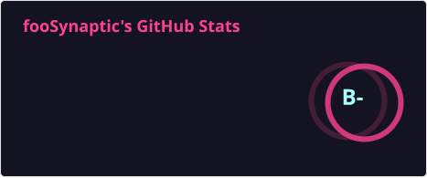

# Hi, I'm fooSynaptic

**ML engineer** focused on **LLM post-training**, **alignment / RL loops**, and **inference tooling** — the glue that turns research ideas into something you can run, measure, and ship.

I care about the assumptions under the code: simulation and tuning help, but they don't replace understanding the update rule.

---

## Focus

- Post-training & optimization loops (GRPO / SAO-style asynchronous rollouts; one-factor ablation of RL mechanisms)
- Fast inference paths when serving stacks lag research realities (PEFT / LoRA merge; prefix KV reuse)
- Frontier model mechanisms (MLA, MoE, DSA, DSpark) as readable maps, not vibes
- Practical OSS hygiene — know when a fix is already upstream before opening a PR

Languages I reach for most: **Python · C++ · Shell**

---

## Recently shipping

| Repo | What it is |
|------|------------|
| [**jev-any-llm**](https://github.com/fooSynaptic/jev-any-llm) | Wrap any instruct LLM into Jev-mode prediction — with KV-share branching so shared prefixes reuse one prefill |
| [**kimi3-align**](https://github.com/fooSynaptic/kimi3-align) | Open one-factor ablation testbed for K3-style RL mechanisms on AReaL |
| [**deepseek-mechanism-atlas**](https://github.com/fooSynaptic/deepseek-mechanism-atlas) | Bidirectional wiki + mdBook of DeepSeek V1→V4 mechanisms (MLA / MoE / DSA / DSpark). [Docs site](https://foosynaptic.github.io/deepseek-mechanism-atlas/) |

## Selected tools

| Repo | What it is |
|------|------------|
| [**peft-adapter-merger**](https://github.com/fooSynaptic/peft-adapter-merger) | Offline PEFT adapter → dense merge, for reliable inference when serving frameworks trail latest LoRA / PEFT |
| [**Single-rollout-async-Optimization**](https://github.com/fooSynaptic/Single-rollout-async-Optimization) | Unofficial re-implementation of SAO (Single-rollout Asynchronous Optimization) |
| [**upstream-fix-gate**](https://github.com/fooSynaptic/upstream-fix-gate) | GO/STOP gate before opening OSS PRs — detect fixes already shipped upstream via `gh` |
| [**py_pcalg**](https://github.com/fooSynaptic/py_pcalg) | Lightweight PC algorithm for causal skeleton discovery — pip + CLI + graph viz |

Older course / trial repos stay in the account for history; they are not what I am building toward now.

---

## GitHub Stats

  

---

## Motto

**fooSynaptic** — *foo* as in `foo` / `bar`: learning means solving for the unknown; *Synaptic* for intelligence wired like synapses.

## Contact

- Blog: [foosynaptic.github.io](https://foosynaptic.github.io)
- GitHub: [@fooSynaptic](https://github.com/fooSynaptic)

